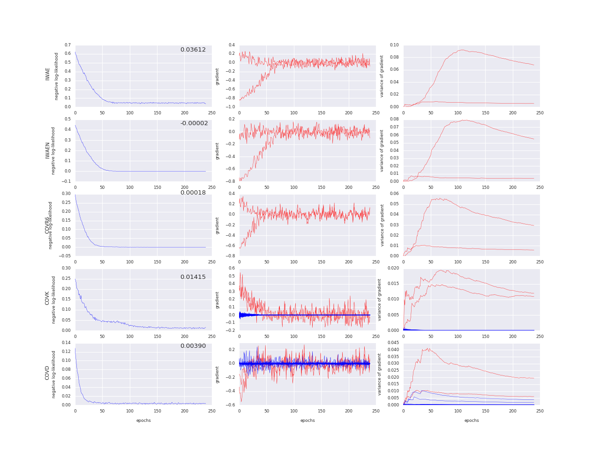

# Joint importance sampling for variational inference

Code for the paper at https://openreview.net/forum?id=BJwOaFJvM

# Example

Use 
```
python 2d.py -model m -target p
```
to run a training loop which fits a normal distribution q to a target p using a sampling scheme m. 

By default p is a Half Gaussian (standard normal distribution multiplied by a step function). Another target can be chosen from the set {HalfGaussian, SliceGaussian, GaussianMixture}.

By default the sampling scheme used consists of drawing k=12 independent samples from q. m can be chosen from the set {IWAE, IWAEN, COVD, COVK, COVR6} the details of which are described in the link.

Use 
```
python plot.py -model m -target p -d dim
```
with corresponding parameters to output the loss and gradient curves.


